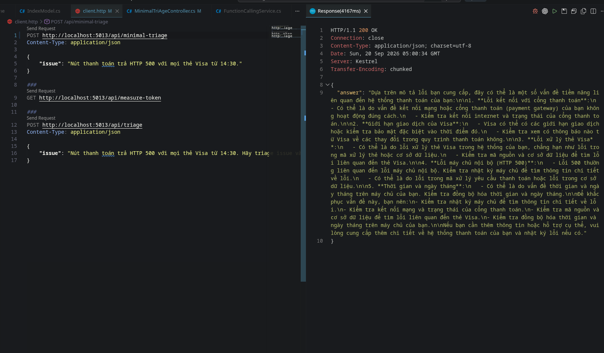
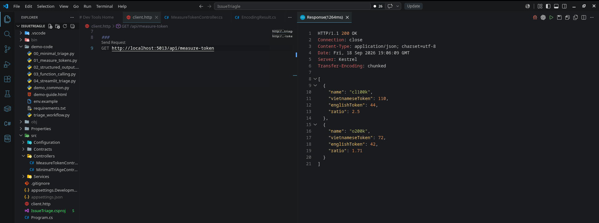
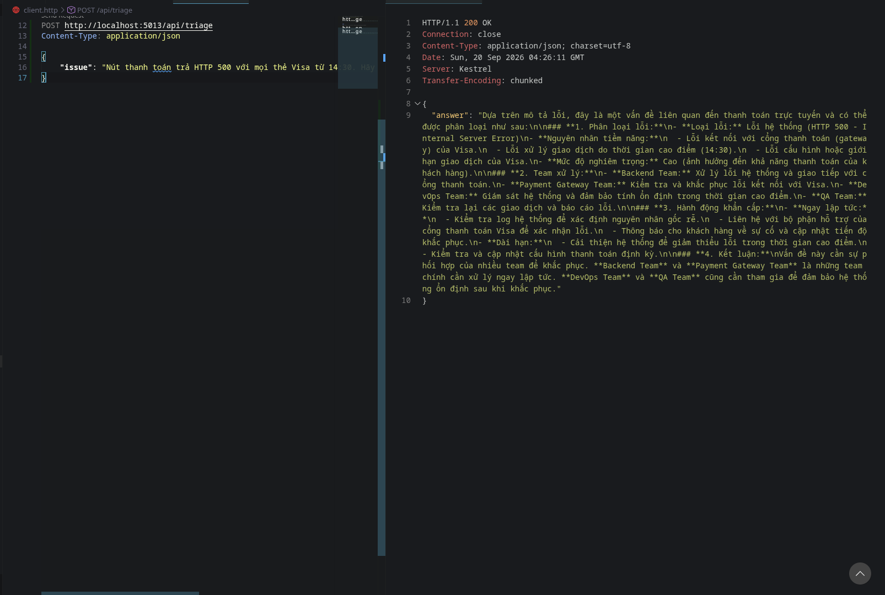
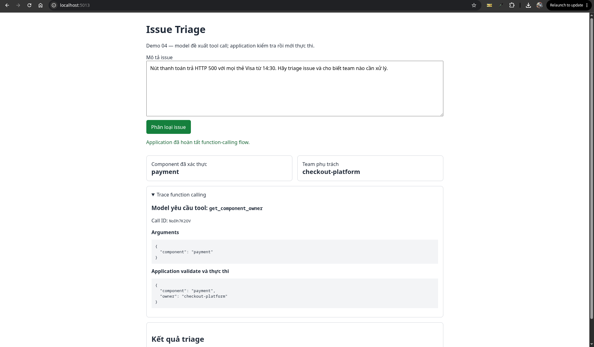

# Issue Triage

A compact ASP.NET Core demo for classifying software incidents with an OpenAI-compatible model. It demonstrates a minimal triage prompt, token measurement, application-controlled function calling, and a Razor Pages UI.

## Tech Stack


## Project Structure

```text
.
├── Public/                         // Result screenshots used by this README
├── Properties/
│   └── launchSettings.json          // Local HTTP and HTTPS launch profiles
├── demo-code/                      // Original Python demos (00–04)
├── src/
│   ├── Configuration/               // Model and API configuration types
│   ├── Contracts/                   // Request and response DTOs
│   ├── Controllers/                 // REST API controllers
│   ├── Exceptions/                  // Custom application exceptions
│   ├── Helpers/                     // Tool validation and component ownership lookup
│   ├── Pages/                       // Razor Pages UI and page models
│   └── Services/                    // OpenAI-compatible API workflows
├── Program.cs                       // Application startup and dependency injection
├── IssueTriage.csproj              // .NET project file and package references
├── appsettings.Development.json    // Development logging configuration
└── client.http                      // Sample HTTP requests
```

## Screenshots



*minimal_triage.png*



*measure_token.png*



*triage_issue.png*



*streamlit_ui.png*

## Local Setup

Prerequisite: [.NET 10 SDK](https://dotnet.microsoft.com/download).

```bash
git clone <repository-url>
cd IssueTriagle
dotnet restore
```

Set the OpenAI-compatible API configuration for the current shell:

Create an appsettings.json file in the root project with the following template: 

```json
{
  "Logging": {
    "LogLevel": {
      "Default": "Information",
      "Microsoft.AspNetCore": "Warning"
    }
  },
  "AIConfiguration": {
    "ApiKey": "your-api-key",
    "BaseUrl": "model-base-url",
    "Model": "model-id"
  },
  "AllowedHosts": "*"
}

```

Build and run:

```bash
dotnet build
dotnet run --launch-profile http
```

Open [http://localhost:5013](http://localhost:5013).

## API Endpoints

```text
GET  /api/measure-token       // Compare English and Vietnamese token counts
POST /api/triage              // Run minimal issue triage
POST /api/function-calling    // Run validated component-owner tool calling
GET  /                         // Open the Razor Pages triage UI
```
